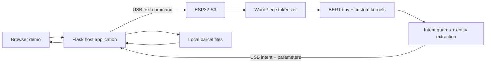

# On-Device BERT for Parcel Tracking

**Natural-language intent classification on an ESP32-S3, connected to a local parcel-tracking application over USB.**

This project takes a small transformer from training and quantization to embedded inference. A fine-tuned BERT-tiny model runs on the microcontroller; a Python/Flask application handles parcel records and provides a browser demo.

**Stack:** C / C++ · ESP-IDF · TensorFlow Lite Micro · BERT · Python · Flask

## What makes this project interesting

- **Embedded transformer inference:** WordPiece tokenization and classification run on the ESP32-S3.
- **Custom inference kernels:** GELU and a hybrid fully connected implementation support the model's FP32 activations and INT8 weights.
- **Measured optimization:** the committed latency sample records **510 ms median inference time** across 30 runs.
- **Hybrid command handling:** a firmware rule layer refines model predictions and extracts order IDs, courier names, and product names.
- **Complete demo path:** browser → Flask → USB serial → ESP32 inference → parcel lookup → browser response.

Inference needs no cloud service at runtime. Parcel storage and the browser server run on the host computer; this is not a standalone parcel database on the chip.

## Reported results and evidence

- **Latency:** 510 ms p50 across the 30 rows in [`kpi_latency.csv`](kpi_latency.csv), covering six phrases. All recorded values are 510 ms at the logged resolution. This measures inference, not the complete browser round trip.
- **Model artifact:** `esp32_firmware/main/bert_model.tflite` is **4,413,640 bytes**, approximately **4.21 MiB**, using dynamic-range quantization.
- **Accuracy:** the original project reports **67/73 = 91.78%** on the synthetic evaluation split. The training script also uses that split to select the best checkpoint, so this is a validation result, not an untouched final-test estimate.
- **Memory:** the original project notes report approximately **197 KB of a 256 KB tensor arena**, allocated in internal memory. This is historical hardware evidence, not a fresh measurement from this documentation refresh.

The original notes describe a reduction from roughly 3.7 seconds to 510 ms using compiler, CPU/cache, memory-placement, and sequence-length changes. Only the final latency CSV is committed; the full optimization history is not independently benchmarked here.

## Architecture



**Start reading:** [firmware command loop](esp32_firmware/main/main.c) · [inference setup](esp32_firmware/main/inference.cc) · [hybrid FC kernel](esp32_firmware/main/custom_fc.cc) · [Flask API](server/app.py)

## Try the host application without hardware

Use Python 3.10+ and run from the repository root:

```sh
python3 -m venv .venv
source .venv/bin/activate
python -m pip install -r server/requirements.txt
DISABLE_SERIAL=1 python server/app.py
```

Open `http://127.0.0.1:5001`. The page and already-classified intent API work without a chip; natural-language inference through `/api/run` requires the ESP32 and returns a clear error when serial is disabled.

Example in another terminal:

```sh
curl http://127.0.0.1:5001/api/intent \
  -H 'Content-Type: application/json' \
  -d '{"intent":"VIEW_ALL","params":{}}'
```

The host is a local development/demo server. Its parcel files contain dated sample records; time-based handlers can move expired orders into history.

## Run the hardware demo

The committed lockfile records **ESP-IDF 5.4.1** and **esp-tflite-micro 1.3.5**. Use an ESP32-S3 board matching the configured **8 MB flash and octal PSRAM** setup.

In an activated ESP-IDF environment:

```sh
cd esp32_firmware
idf.py set-target esp32s3
idf.py build
idf.py -p YOUR_SERIAL_PORT flash
```

The quantized model and vocabulary are already included. Return to the repository root and start the host with the actual device path:

```sh
SERIAL_PORT=/dev/cu.usbmodem1101 python server/app.py
```

Replace the example path with your board's serial port. Close `idf.py monitor` before using the web demo: the Flask serial runner needs exclusive access to the port. Click **DEMO** in the UI for the guided tour.

## Checks

```sh
python3 scripts/test_host.py
```

This runs the seven existing handler tests against a temporary copy of the server folder, preserving the committed sample data. It needs no chip, Flask process, or third-party Python packages. These are host-handler checks; they do not validate firmware inference accuracy or hardware latency.

## Training and model export

The checked-in dataset contains 288 training and 73 evaluation examples. The root scripts cover dataset generation, PyTorch fine-tuning, TensorFlow conversion, and TFLite exports. Fine-tuned weight files are excluded, so re-exporting requires retraining or supplying a compatible checkpoint.

See [training and reproduction notes](docs/training.md) for the script sequence and current limitations. The historical [project notes](docs/project-notes.md) and [presentation preparation](PRESENTATION_PREP.md) retain additional demo and optimization context.

## Repository layout

```text
esp32_firmware/    ESP-IDF project, tokenizer, inference, model, and kernels
server/            Flask UI/API, serial bridge, parcel handlers, and sample data
scripts/           Isolated host-test runner
data/              Synthetic training and evaluation phrases
tflite_models/     Exported model variants
finetuned_model/   Tokenizer/configuration artifacts; weights excluded
docs/              Reproduction notes and historical project write-up
*.py               Training, conversion, and diagnostic entry points
kpi_latency.csv    Recorded inference latency sample
```

## Limits and next steps

The small synthetic dataset and keyword overrides limit generalization. Use separate training, validation, and final-test splits before making broader accuracy claims. There is no live courier integration. Firmware builds, model conversion, and device measurements require their respective toolchains and were not rerun during this portfolio refresh.

## Credits

The project builds on `prajjwal1/bert-tiny`, TensorFlow Lite Micro, Espressif ESP-IDF, and the original ELEC2302 C parcel-tracker format. Existing component and model notices are preserved. No repository-wide open-source license has been selected.
